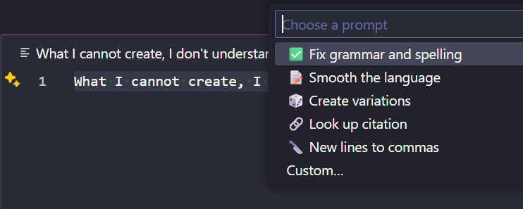

# ChatGPT Right Click VS Code Extension

## Overview
ChatGPT Right Click is a Visual Studio Code extension that allows you to quickly access custom ChatGPT prompts and apply them to selected text from the editor’s right-click context menu.


## Features
* Fully customizable prompts
* ChatGPT model settings per prompt
* Web search support per prompt

## Custom Prompt Ideas
```JSON
        {
            "label": "✅ Fix grammar and spelling",
            "template": "Fix the grammar and spelling of '{selection}'.\nPreserve all formatting, line breaks, and special characters. Do not add or remove any content. Return only the corrected text."
        },
        {
            "label": "📝 Smooth the language",
            "template": "Smooth this text: {selection} \nReturn only the edited text without any comments. Do not remove footnotes from markdown.",
            "model": "gpt-4.1"
        },
        {
            "label": "🎲 Create variations",
            "template": "Create 5 variations of the selected text: {selection}\nReturn the original text plus the variations, one per paragraph, no bullet points."
        },
                {
            "label": "🔗 Look up citation",
            "template": "Create a citation in APA format including URL for this publication: {selection}\nMake sure the URL is valid. Prefer DOI URL or other scientific source. Do not add any markdown format, use just plain text. Return just the citation, no other comments.",
            "model": "gpt-4.1",
            "enableWebsearch": true
        },
        {
            "label": "🔪 New lines to commas",
            "template": "Replace new lines with commas in `{selection}`\nEg.'123\n456\n789' -> '123,456,789'. Return only the result, no comments.",
            "model": "gpt-4.1-nano"
        }
```

## Getting Started
1. **Install the extension**
   - Download and install the `.vsix` file from the [Releases](#) or the VS Code Marketplace.
2. **Reload VS Code**
   - After installation, reload or restart VS Code to activate the extension.
3. **Set your OpenAI API key** in Extension Settings
4. **Set your custom prompts** in Extension Settings
5. **Usage**
   - Right-click on any text selection in the editor.
   - Select _ChatGPT Right Click: Run on Selection_
   - Choose a prompt
   - The selected text will be replaced with the response from ChatGPT

## Contributing

Contributions are welcome! Please open issues or pull requests on the [GitHub repository](https://github.com/MichalHudecek/chatgpt-right-click).


## License
[MIT](https://github.com/MichalHudecek/chatgpt-right-click/blob/main/LICENSE)

## Development
### Rebuilding the package for debugging
`yarn run compile`

Press F5 in VS Code to launch debugging.

### Rebuilding the package for publishing

```
npm ci
npm run compile
npx @vscode/vsce package
```